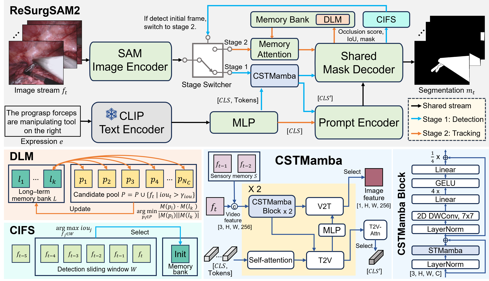

# ReSurgSAM2: Referring Segment Anything in Surgical Video via Credible Long-term Tracking 

Official implementation for ReSurgSAM2, an innovative model that leverages the power of the Segment Anything Model 2 (SAM2), integrating it with credible long-term tracking for real-time surgical video segmentation.
> [ReSurgSAM2: Referring Segment Anything in Surgical Video via Credible Long-term Tracking 
]()
>
> Haofeng Liu, Mingqi Gao, Xuxiao Luo, Ziyue Wang, Guanyi Qin, Junde Wu, Yueming Jin
>
> Early accepted by MICCAI 2025

The source code is coming soon.

## Overview

Surgical scene segmentation is critical in computer-assisted surgery and is vital for enhancing surgical quality and patient outcomes. We introduce ReSurgSAM2, a two-stage surgical referring segmentation framework that:

- Leverages SAM2 to perform text-referred target detection with our Cross-modal Spatial-Temporal Mamba (CSTMamba) for precise detection and segmentation
- Employs a Credible Initial Frame Selection (CIFS) strategy for reliable tracking initialization
- Incorporates a Diversity-driven Long-term Memory (DLM) that maintains a credible and diverse memory bank for consistent long-term tracking
- Operates in real-time at 61.2 FPS, making it practical for clinical applications
Achieves substantial improvements in accuracy and efficiency compared to existing methods

## Acknowledgement

This research utilizes datasets from [Endovis 2017](https://endovissub2017-roboticinstrumentsegmentation.grand-challenge.org/Downloads/) and [Endovis 2018](https://endovissub2018-roboticscenesegmentation.grand-challenge.org/Downloads/). If you wish to use these datasets, please request access through their respective official websites.

Our implementation builds upon the [segment anything 2](https://github.com/facebookresearch/segment-anything-2) framework and [CLIP](https://github.com/openai/CLIP). We extend our sincere appreciation to the authors for their outstanding work and significant contributions to the field of video segmentation.

